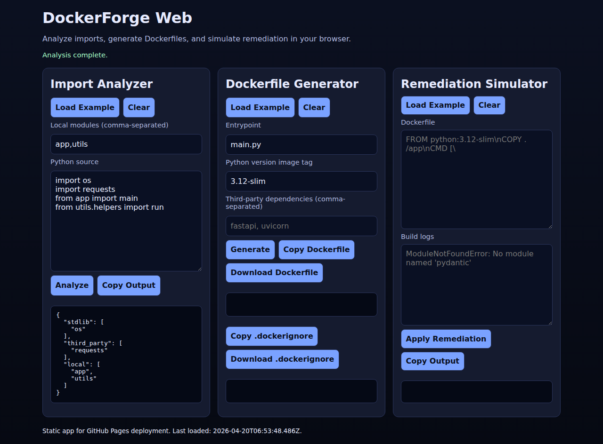
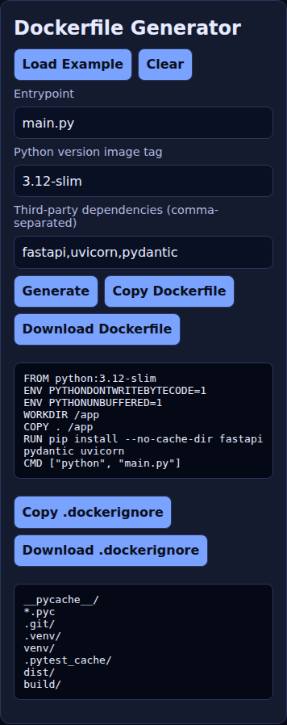
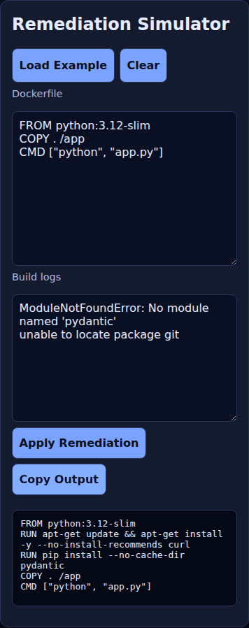
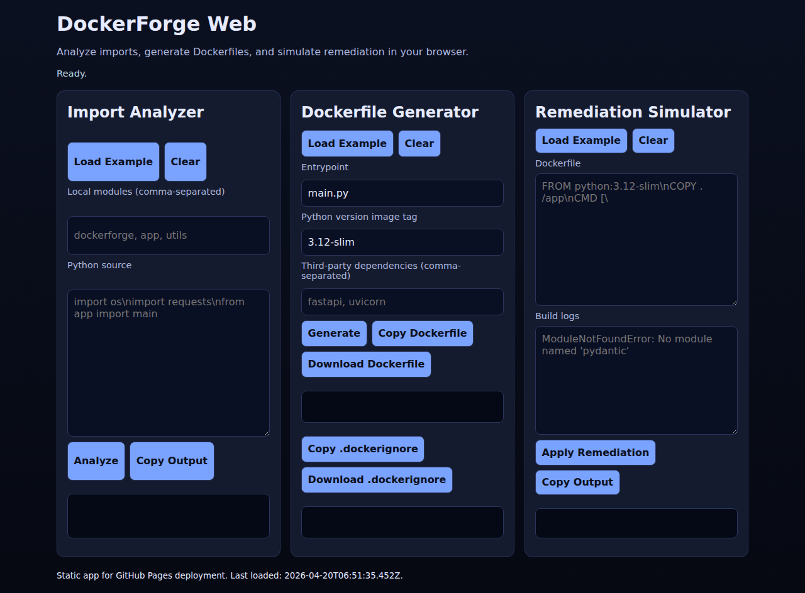
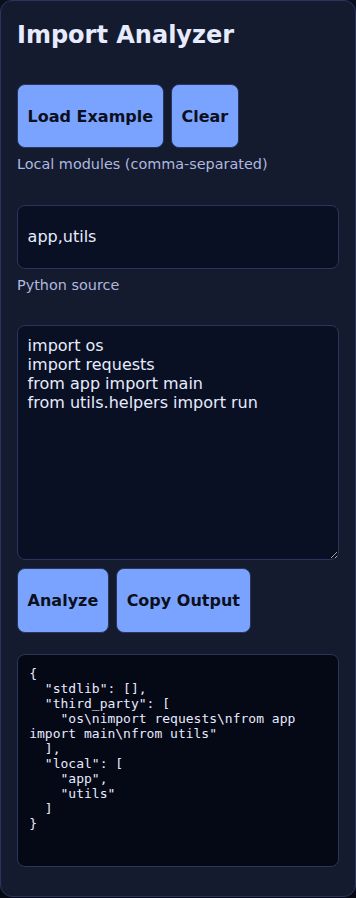

# DockerForge

DockerForge is a Python toolkit + web app for:

- analyzing Python imports
- generating production-friendly Dockerfile and `.dockerignore`
- applying remediation suggestions from Docker build logs

---

## Current Production Gaps Identified and Addressed

This iteration closes the biggest practical gaps for a production-facing repo:

- Added a hosted web UI surface (`docs/`) instead of CLI-only usage.
- Added GitHub Pages deployment automation (`deploy-pages.yml`).
- Added post-deploy verification job to fail if deployed URL is not reachable.
- Added richer UX in the web app (examples, clear actions, copy/download, status feedback).
- Added detailed README with media assets, operational guidance, and troubleshooting.

---

## Web App Features

The GitHub Pages app includes three workflows:

1. **Import Analyzer**
   - Classifies imports into `stdlib`, `third_party`, and `local`.
   - Supports quick example loading and copy output.

2. **Dockerfile Generator**
   - Generates a Dockerfile from entrypoint, Python image tag, and dependencies.
   - Generates `.dockerignore`.
   - Supports copy and file download for both artifacts.

3. **Remediation Simulator**
   - Parses build-log patterns (module missing / apt package issues / WORKDIR issues).
   - Patches Dockerfile content accordingly.
   - Supports copy output.

---

## Project Layout

```text
DockerForge/
├── pyproject.toml
├── src/dockerforge/
│   ├── cli.py
│   ├── core/
│   ├── remediation/
│   └── utils/
├── docs/
│   ├── index.html
│   ├── app.js
│   ├── styles.css
│   └── assets/
│       ├── screenshots/
│       └── videos/
└── .github/workflows/
    └── deploy-pages.yml
```

---

## Screenshots

### Full App


### Populated + Generated Output



### Individual Panels





---

## Short Demo Videos

> Stored as lightweight GIF demo clips in-repo for easy viewing.

### Overview Demo



### Workflow Demo



---

## Local Development

### 1) Install package

```bash
cd /home/runner/work/DockerForge/DockerForge
python -m pip install -e .
```

### 2) Run tests

```bash
cd /home/runner/work/DockerForge/DockerForge
python -m unittest discover -s tests -v
```

### 3) Run CLI

```bash
dockerforge --help
```

### 4) Run web app locally

```bash
cd /home/runner/work/DockerForge/DockerForge/docs
python -m http.server 8000
```

Open: `http://localhost:8000`

---

## GitHub Pages Deployment

Deployment workflow: `/home/runner/work/DockerForge/DockerForge/.github/workflows/deploy-pages.yml`

### Trigger Conditions

- Push to `main` affecting `docs/**` or workflow file
- Manual `workflow_dispatch`

### Required Repository Setting

In GitHub repo settings:

- **Pages → Source = GitHub Actions**

### Expected URL

- `https://DARREN-2000.github.io/DockerForge/`

### Is it deployed and running right now?

From the latest workflow inventory, the Pages deployment workflow is not visible on default-branch workflow listings yet, so production Pages deployment is **not yet confirmed live** from this branch alone.

To make it live:

1. Merge this branch to `main`.
2. Ensure **Pages source = GitHub Actions**.
3. Run/confirm `Deploy DockerForge Web to GitHub Pages` workflow success.
4. Open the URL above.

---

## Production Readiness Notes

- Static hosting architecture (low operational overhead).
- Deterministic client-side behavior with no external runtime dependency.
- Deployment verification step (`curl -fsSLI`) after publish.
- No secrets or backend credentials required for the web app.

---

## Troubleshooting

### Tests fail with `ModuleNotFoundError: dockerforge`

Install editable package first:

```bash
cd /home/runner/work/DockerForge/DockerForge
python -m pip install -e .
```

### GitHub Pages URL not available

- Confirm repo Pages source is **GitHub Actions**.
- Confirm deployment workflow ran on `main` and succeeded.
- Re-run workflow manually using `workflow_dispatch`.

### UI clipboard actions fail

Some browsers block clipboard API in restricted contexts. Use manual copy from output panels if needed.
