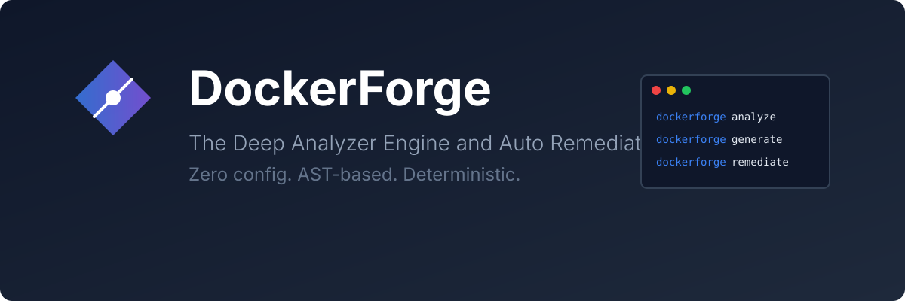
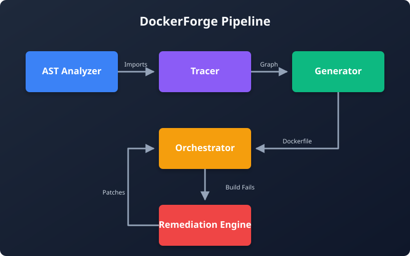
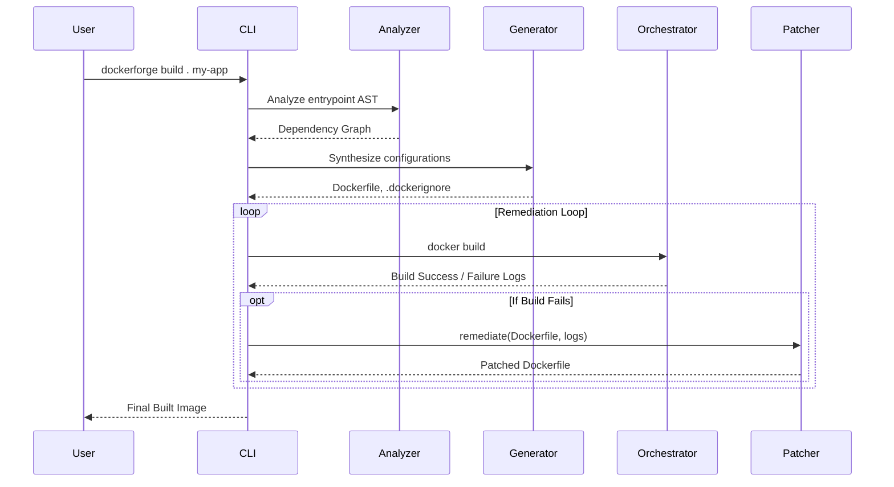

<p align="center">
  <picture>
    <source media="(prefers-color-scheme: dark)" srcset="docs/assets/hero.svg">
    <source media="(prefers-color-scheme: light)" srcset="docs/assets/hero.svg">
    
  </picture>
</p>

<p align="center">
  <b>Production-ready prototype for a Deep Analyzer Engine and Auto Remediation Loop.</b>
</p>

<p align="center">
  <a href="https://github.com/dockerforge-org/dockerforge/actions"></a>
  <a href="https://pypi.org/project/dockerforge/"></a>
  <a href="https://pypi.org/project/dockerforge/"></a>
  <a href="LICENSE"></a>
</p>

---

## ⚡ The Problem

Writing and maintaining `Dockerfile`s for complex Python applications is tedious and error-prone. Standard tools rely on `requirements.txt` or `pip freeze`, which often bundle bloated, environment-specific, or completely unused packages. When builds fail due to missing C-extensions or system-level dependencies (like `apt` packages), developers spend hours parsing cryptic build logs to figure out what went wrong.

## 🚀 The Solution

**DockerForge** takes a radically different approach. It acts as an orchestrator that understands your code dynamically.

1. **Statically Analyzes** your Abstract Syntax Tree (AST) to find exactly what you import.
2. **Traces** your local dependency graph recursively.
3. **Synthesizes** a highly optimized, lean `Dockerfile`.
4. **Orchestrates** the build process and captures the streaming logs.
5. **Remediates** automatically by mapping build failures to known patterns (e.g., missing `apt` packages or missing modules) and deterministically patching the `Dockerfile` until the build succeeds.

Zero configuration. No LLM hallucinations. Just explicit, deterministic build engineering.

---

## ✨ Core Features

- **AST-Based Import Analysis**: Uses Python's native `ast` to classify imports (`stdlib`, `third_party`, `local`) deterministically.
- **Recursive Dependency Tracing**: Walks local files via DFS to map the exact subset of code your entrypoint actually needs.
- **Dockerfile Synthesis**: Generates `Dockerfile` (using `python:3.12-slim` by default) and `.dockerignore`.
- **Docker Orchestration**: Streams live build output via standard `subprocess` integration with the Docker daemon.
- **Auto Remediation Loop**: Identifies failures (e.g., `ModuleNotFoundError`, missing `WORKDIR`, `apt` index missing) via Regex signatures and patches the configuration dynamically.
- **CLI-First**: Powerful `analyze`, `generate`, `build`, and `remediate` entrypoints.

---

## 🏗 Architecture Overview

<p align="center">
  <picture>
    <source media="(prefers-color-scheme: dark)" srcset="docs/assets/architecture.svg">
    <source media="(prefers-color-scheme: light)" srcset="docs/assets/architecture.svg">
    
  </picture>
</p>

### Execution Flow


```mermaid
sequenceDiagram
    participant User
    participant CLI
    participant Analyzer
    participant Generator
    participant Orchestrator
    participant Patcher

    User->>CLI: dockerforge build . my-app
    CLI->>Analyzer: Analyze entrypoint AST
    Analyzer-->>CLI: Dependency Graph
    CLI->>Generator: Synthesize configurations
    Generator-->>CLI: Dockerfile, .dockerignore

    loop Remediation Loop
        CLI->>Orchestrator: docker build
        Orchestrator-->>CLI: Build Success / Failure Logs

        opt If Build Fails
            CLI->>Patcher: remediate(Dockerfile, logs)
            Patcher-->>CLI: Patched Dockerfile
        end
    end

    CLI-->>User: Final Built Image
```

---

## 📦 Installation

DockerForge requires Python 3.10+.

```bash
git clone https://github.com/dockerforge-org/dockerforge.git
cd dockerforge
python -m pip install -e .
```

---

## 🚦 Quick Start

### 1. Analyze Your Code
Extract the exact dependency graph of your application.

```bash
dockerforge analyze src/main.py
```
*Output: Breakdown of stdlib vs third-party vs local dependencies.*

### 2. Generate Container Specs
Synthesize the optimal `Dockerfile` and `.dockerignore`.

```bash
dockerforge generate src/main.py
```
*Output: `Dockerfile` and `.dockerignore` created in your current directory.*

### 3. Build the Image
Trigger a Docker build.

```bash
dockerforge build . my-app-tag
```

### 4. Remediate Failures
If the build fails (e.g. missing `curl` or a python module), trigger the remediation engine against the failure logs.

```bash
dockerforge remediate Dockerfile build.log
```
*DockerForge will inject the missing `apt-get` or `pip install` dependencies directly into the `Dockerfile`.*

---

## 📚 Documentation

Dive deeper into the internals of DockerForge on our official documentation site.

- [Getting Started](docs/getting-started.md)
- [Installation Guide](docs/installation.md)
- [Architecture Deep Dive](docs/architecture.md)
- [Design Decisions](docs/design.md)
- [Project Internals](docs/internals.md)
- [Configuration API](docs/configuration.md)
- [Troubleshooting & FAQ](docs/faq.md)

---

## 🤝 Community & Enterprise

DockerForge is an open-source tool built for production scale.

- **Want to contribute?** Read our [Contributing Guide](CONTRIBUTING.md) and [Code of Conduct](CODE_OF_CONDUCT.md).
- **Need help?** Check out [Support](SUPPORT.md) or open an issue.
- **Found a security flaw?** Please follow our [Security Policy](SECURITY.md).
- **Project Governance**: Read our [Governance Model](GOVERNANCE.md) and meet the [Maintainers](MAINTAINERS.md).
- **Where are we headed?** View the [Roadmap](ROADMAP.md).

For enterprise support, priority issue resolution, and SLAs, contact `enterprise@dockerforge.io`.

---

<p align="center"><sub>MIT License · © 2024 DockerForge Contributors</sub></p>
