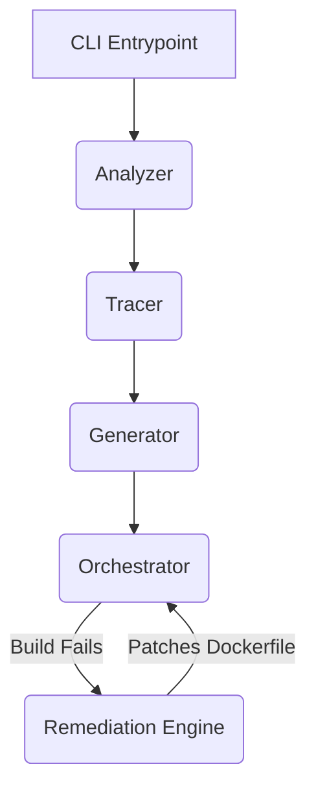

# Architecture Overview

DockerForge is constructed from decoupled, modular components designed for reliability and determinism.

## System Components

### 1. `dockerforge.core.analyzer`
Uses `ast.parse` to extract imports (`ast.Import` and `ast.ImportFrom`) and cross-references them against `sys.stdlib_module_names`, local project structure, and `importlib.util.find_spec` to categorize dependencies.

### 2. `dockerforge.core.tracer`
Performs a recursive Depth-First Search (DFS) on the local dependency graph, ensuring that if `main.py` imports `utils.py`, the dependencies of `utils.py` are also captured.

### 3. `dockerforge.core.generator`
Takes the dependency map and synthesizes a `python:3.12-slim` Dockerfile and standard `.dockerignore`.

### 4. `dockerforge.core.orchestrator`
Wraps `subprocess.Popen` to execute `docker build`, yielding log lines as they stream from the daemon.

### 5. `dockerforge.remediation.patcher`
Applies regex-based pattern matching (from `patterns.py`) to build logs. If a match is found, it deterministically injects fixes (e.g., `RUN apt-get update`) into the `Dockerfile`.
